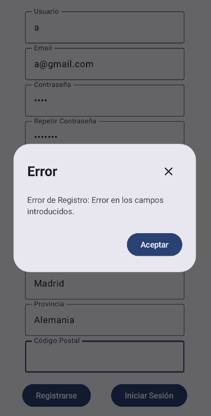

## Nombre del proyecto

- ApiRest_Tareas

## Descripción de los documentos

- Para este proyecto tendremos los siguientes documentos:
  - Usuarios: Que contendrá los datos de los usuarios como su username, password, roles y dirección.
  - Tareas: Con los datos de las tareas, nombre, descripción, fecha, estado.
  - Direccion: Con los datos de las direcciones de los usuarios.

## Endpoints a desarrollar

- Para el usuario vamos a utilizar el Endpoint de "/usuarios". Dentro de este endpoint vamos a generar otros diferentes endpoints que ejecutarán las funciones:
  - POST "/login" que realizará el logeo de un usuario, o dará fallo si se equivoca.
  - POST "/register" que permite registrar un usuario que no exista ya y que tenga sus campos correctamente.

 prueba
- Para las tareas utilizaremos el endpoint "/tareas". Y dentro tendremos estos endopoints:
  - GET "/mostrar/{username}" que muestra las tareas de un usuario.
  - GET "/mostrarTodas" que muestra todas las tareas pero debes ser admin para poder verlas.
  - POST "/agregarTarea/{username}" que agrega una tarea a un usuario.
  - POST "/actualizarEstado/{username}" que actualiza el estado de la tarea.
  - DELETE "/eliminarTarea{username}" que permite eliminar una tarea de un usuario.

## Lógica de negocio

- Para el documento usuario:
  - Para registrarse el usuario deberá tener todos sus campos correctamente y no tener campos únicos iguales a alguno en la base de datos.
  - Para que se inserte correctamente deberá tener en la dirección una dirección que exista.
  - Para logearse el usuario deberá existir en la base de datos y que los datos coincidan, tanto username como password.

- Para las tareas se diferenciará en dos tipos de usuarios según sus roles:
  - USER: Estos usuarios solo tendrán acceso a sus tareas y podrán borrar, actualizar o insertar tareas propias, no la de los demás.
  - ADMIN: Estos usuarios con poder administrativo podrán ver todas las tareas, eliminar cualquier tarea de cualquier usuario, dar de altar tareas a cualquier usuario y marcar cualquier tarea como realizada.

## Excepciones

- Tendremos varias excepciones en nuestro programa:
  - NotFoundException que dará un error 404 al no encontrar datos en la base de datos.
  - BadRequestException que dará un error 400 cuando algo haya salido como no se esperaba.
  - UnauthorizedException que dará un error 401 cuando no se pueda autorizar el usuario en el login.

## Restricciones 

- Las restricciones de nuestro proyecto se dividirán en públicos:
  - Los endpoints para login y register que podrá acceder cualquier persona.
  

- Y privados, de los cuales se divirán en dos a su vez:
  - Los privados que podrán entrar todos los usuarios en donde pueden entrar en los endpoints referentes a sus propias tareas.
  - Y los privados solo para los ADMIN: que solo pueden acceder los usuarios con rol ADMIN, como por ejemplo al endpoint de mostrarTodas.

## PRUEBAS GESTIÓN USUARIOS

# Login
- Para logearnos en la app deberemos introducir nuestro usuario y contraseña que exista en la base de datos. 
  - Para que funcione los campos deben estar rellenados correctamente ya que si no saltará un mensaje de error.

  

  - La primera prueba que vamos a realizar es la de ingresar un usuario y contraseña erróneo para ver como nos salta la excepción en ambos lados. En este caso vamos a intentar logearnos con Pepito78 y con la contraseña 771122 que no existe en la base de datos.
  
  

  - Le daremos a Iniciar sesión y nos saltará una ventana emergente con el error que nos está mandando la API, que podremos ver en la app, en el log y en la api.
  
  
  

  - En cambio si introducimos datos correctos como el usuario jose y la contraseña 1234 nos devolverá el token con el que podremos iniciar sesión y obtener las tareas de jose.
  
  

  - Como podemos ver en el log de la imagen en Login habremos obtenido el token y habremos entrado en la app mostrando las tareas del usuario. Ya que si miramos la base de datos tenemos 3 tareas y solo una es de jose.
  
  

- Aqui tenemos un video de prueba del login: https://drive.google.com/file/d/1hrbgAJx3_XmbZ7LFET6CEthBx-Gcv7RB/view?usp=drive_link

# Register

- Una vez hemos terminado el login ahora pasaremos con el registro. Para el registro la app pedirá al usuario que ingrese todos sus datos para agregar al usuario. Para que funcione deberemos rellenar todos los campos y que el formato del gmail sea correcto. Aunque solo falte uno dará fallo.

  - Si nos equivocamos introduciendo las contraseñas iguales nos saltará un error de la api.

  
  

  - Si introducimos un municipio no válido nos dará un error indicando que ese municipio no es válido.

  

  - Lo mismo pasará si nos equivocamos en la provincia.

  

  - Y por último pero no menos importante si intentamos agregar un usuario ya existente nos dará error

  

  - Tambíen en la api porbamos que el rol sea admin o user aunque en esta parte lo he facilitado al usuario utilizando un menú desplegable para que no pueda introducir otro valor que no sea USER o ADMIN, aunque lo dejo en la api por si las moscas.

  
  
- Ahora ingresaremos datos correctamente y se registrará el usuario y nos mandará a la pantalla del login para que iniciemos sesión con ese usuario

- Como podemos observar en el log se ha registrado y si miramos en la base de datos podremos ver como está añadido.

- Y aquí tenemos un vide de prueba del register: https://drive.google.com/file/d/1HpMDthfmTVLv4zpzO8Xvu_AHsMNeNxAH/view?usp=drive_link

## Tareas

- Para las tareas primero vamos a iniciar sesión con un usuario USER y luego con otro ADMIN.
- Para estas pruebas vamos a usar el usuario Jose (USER) y el usuario Pepe (ADMIN).

# Rol User

- Primero iniciamos sesión con Jose.

- Para insomnia podremos ver nuestras tareas desde TareaUsuario.

- Si intentamos ver las tareas de otros nos saltará un error 401.

- Ahora agregaremos una tarea a nosostros y luego una a otra persona que nos dará error.

- A la hora de actualizar pasará lo mismo solo podemos actualizar nuestra tarea.

- Y ahora para borrar.

- Una vez inciada veremos que solo nos aparece las tareas de jose en la app.

- Por lo que solo podemos activar como hecha o borrar sus propias tareas.

- En cambio si queremos guardar una tarea y cambiamos nuestro nombre de usuario a otro usuario como creador, nos dará un error ya que el usuario solo puede crear tareas a él mismo.

- De esta manera el usuario user solo puede crear, actualiza, y borrar sus propias tareas, aunque desde insomnia también controlamos que lo de borrar y actualizar sea solo de sus propias tareas.

# Rol Admin

- Para el admin iniciaremos sesión con el usuario Pepe que es rol admin

- Ahora veremos nuestras tareas las de otros y la de todos.

- Como podemos ver pepe puede ver las tareas de otro y ver todas porque es admin.

- Agregaremos una tarea a pepito desde pepe.

- Ahora actualizaré el estado de una tarea de otra cuenta.

Y por último borraremos una tarea a otro usuario.

- Como podemos comprobar a pepe si le aparecen todas la tareas de todos los usuarios por que es admin

- Por lo que puede agregar, actualizar, y eliminar cualquier tarea aunque no sea suya. Agregaremos una tarea a jose desde pepe y actualizaremos sus tareas para ver los cambios en la base de datos.

